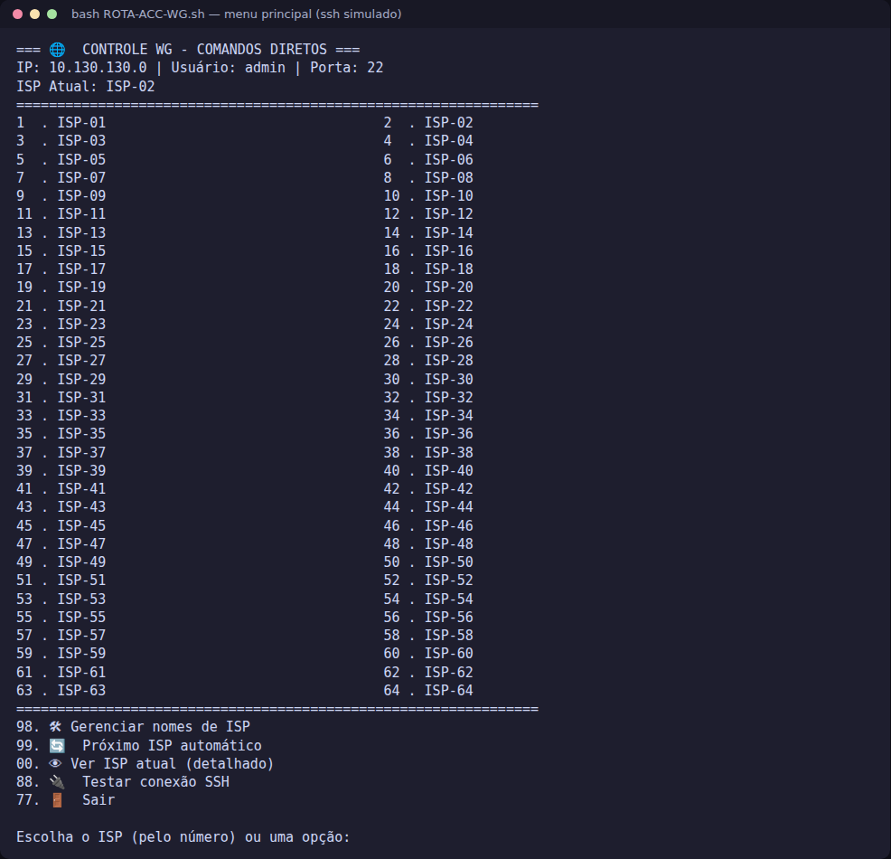
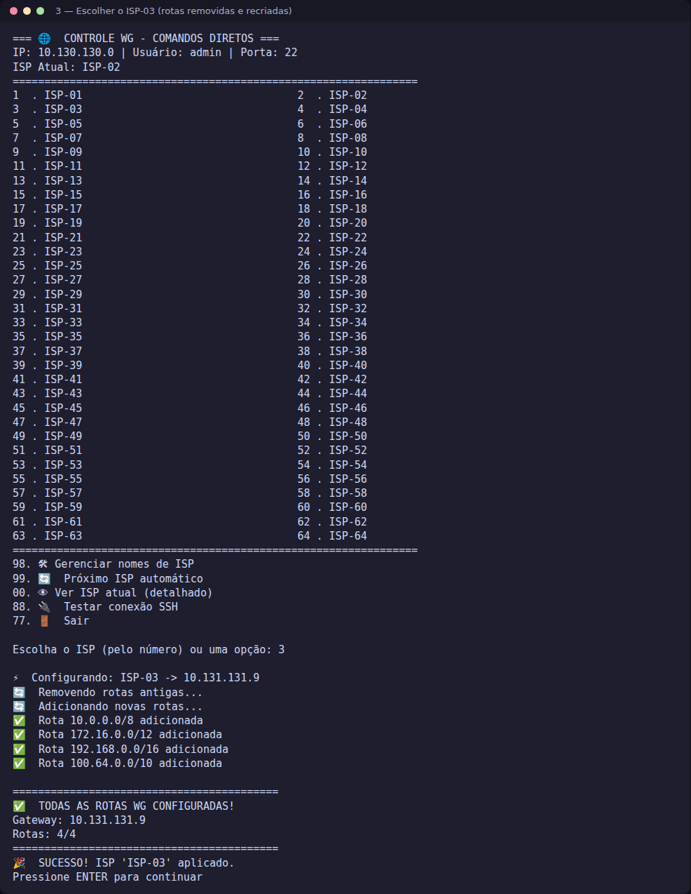
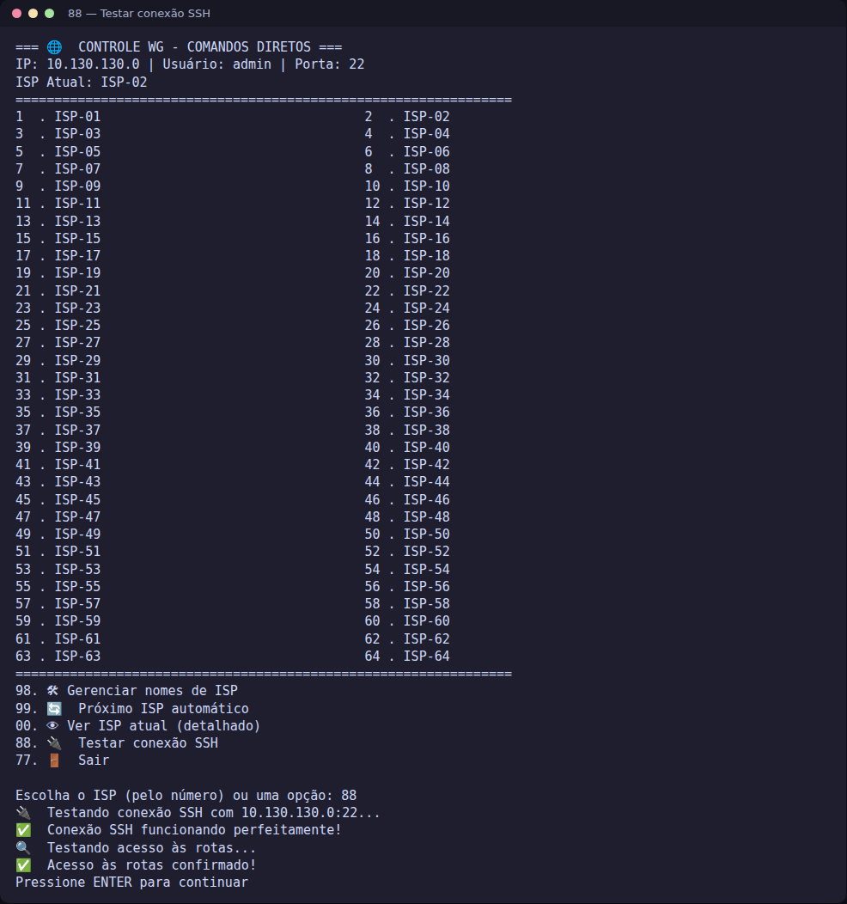
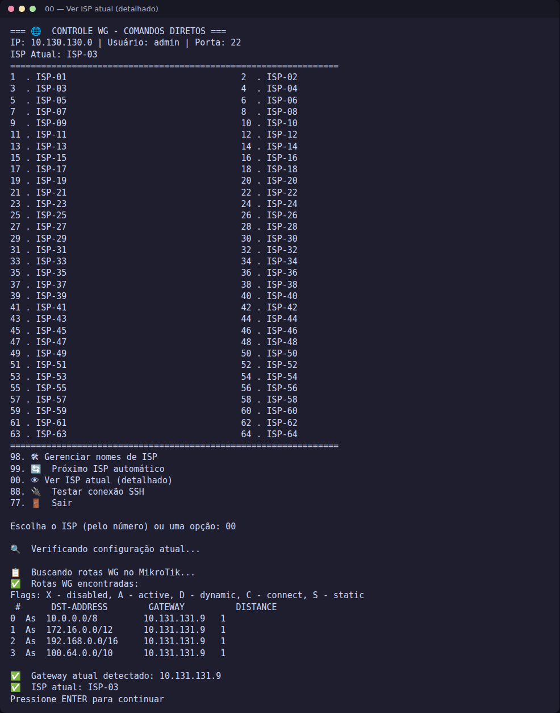
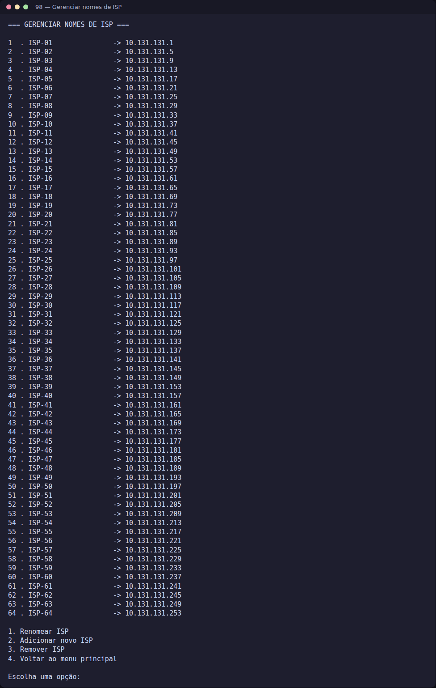
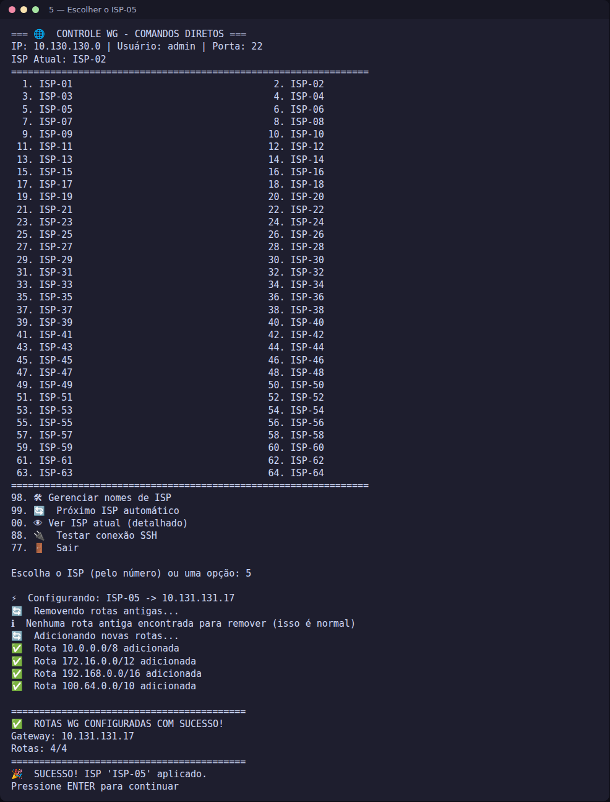

<!-- readme-padrao:v1 — ver doc/padrao-readme.md em assistentes-ia -->
<div align="center">

# 🌐 Controle WG - MikroTik

**Script para controlar rotas WireGuard em MikroTik por SSH, alternando entre ISPs e gateways.**


</div>

---

<details>
<summary>🧭 Sumário — clique para expandir</summary>

[📋 Descrição](#-descrição) · [✨ Funcionalidades](#-funcionalidades) · [🚀 Instalação](#-instalação) · [🤝 Créditos](#creditos) · [📄 Licença](#licenca) · [🖼️ Telas e menus](#telas)

</details>

Script para controle e gerenciamento de rotas WireGuard em dispositivos MikroTik via SSH.

## 📋 Descrição

Este projeto fornece uma interface amigável para gerenciar rotas WireGuard em MikroTik, permitindo alternar entre diferentes ISPs/gateways de forma simples e eficiente.

## ✨ Funcionalidades

- 🔄 Alternância automática entre ISPs
- 👁️ Detecção do ISP atual
- 🛠️ Gerenciamento de nomes de ISPs
- 🔌 Teste de conectividade SSH
- ⚡ Configuração direta via comandos SSH
- 💾 Configuração persistente de ISPs

<!-- telas:inicio -->
<a name="telas"></a>

## 🖼️ Telas e menus

Capturas reais da interface de terminal dos dois scripts (`ROTA-ACC-WG.sh` e `ROTA-ACC-WG.py`, mesmo menu). **Ambiente de demonstração:** para não tocar em nenhum roteador, as capturas foram feitas com um `ssh` simulado que responde como o MikroTik; a interface, os textos e o fluxo são os dos scripts. Os endereços do menu são os valores de exemplo do próprio script (ISP-01 a ISP-64).

<div align="center">

<br><sub><b>Menu principal (bash)</b> — cabeçalho com IP, usuário e porta do MikroTik, ISP atual e a lista numerada de ISPs, em duas colunas.</sub>
</div>

### Menus

| Menu | Para que serve |
|---|---|
| **1 a 64 (número do ISP)** | aplica o ISP escolhido: remove as rotas com comentário `ROTA ACC WG RFC` e cria as quatro rotas RFC 1918/CGNAT com o gateway dele. |
| **98 — Gerenciar nomes de ISP** | abre o submenu: 1 Renomear ISP, 2 Adicionar novo ISP (nome e gateway), 3 Remover ISP (com confirmação), 4 Voltar. |
| **99 — Próximo ISP automático** | passa para o ISP seguinte na ordem dos gateways. |
| **00 — Ver ISP atual (detalhado)** | mostra as rotas WG encontradas no MikroTik e qual gateway está ativo. |
| **88 — Testar conexão SSH** | testa a conexão com a chave `~/.ssh/mikrotik_wgkey` e o acesso às rotas. |
| **77 — Sair** | encerra o script. |

### Galeria

<table>
<tr>
<td width="50%"><br><b>Escolher um ISP</b><br><sub>digitar o número remove as rotas antigas e recria as 4 rotas (10.0.0.0/8, 172.16.0.0/12, 192.168.0.0/16 e 100.64.0.0/10) apontando para o gateway do ISP.</sub></td>
<td width="50%"><br><b>88 — Testar conexão SSH</b><br><sub>confere a conexão e o acesso às rotas antes de mexer em qualquer coisa.</sub></td>
</tr>
<tr>
<td width="50%"><br><b>00 — Ver ISP atual</b><br><sub>lista as rotas WG que existem no MikroTik e o gateway em uso.</sub></td>
<td width="50%"><br><b>98 — Gerenciar nomes de ISP</b><br><sub>lista o nome e o gateway de cada ISP; permite renomear, adicionar e remover.</sub></td>
</tr>
<tr>
<td width="50%"><br><b>Versão Python</b><br><sub>a mesma interface em `ROTA-ACC-WG.py` (aqui, escolhendo o ISP-05).</sub></td>
</tr>
</table>

<!-- telas:fim -->

## 🚀 Instalação

### Pré-requisitos

- Dispositivo MikroTik com SSH habilitado
- Chave SSH configurada
- Usuário com permissões apropriadas

### Configuração

1. **Clone o repositório:**
   ```bash
   git clone https://github.com/CarlosSuporteISP/Controle_Rotas_WG_MikroTik.git
   cd controle-wg-mikrotik

2. Configure a chave SSH motivo de usar essa chave mikrotik não aceita ed25519:
   ```bash
   ssh-keygen -t rsa -b 2048 -f ~/.ssh/mikrotik_wgkey -N ""
   ```
   
   ### como essa criptografia e mais fraca provavel vai ter que colocar isso abaixo no seu /etc/ssh/ssh_conf

   ```bash
   Host 10.130.130.0
    HostName 10.130.130.0
    User admin
    Port 22
    IdentityFile ~/.ssh/mikrotik_wgkey
    HostKeyAlgorithms +ssh-rsa
    PubkeyAcceptedAlgorithms +ssh-rsa
    KexAlgorithms +diffie-hellman-group1-sha1
    Ciphers +aes128-cbc
    StrictHostKeyChecking no
   ```
   ```bash
   chmod +x ROTA-ACC-WG.py
   ### Ou para a versão shell
   chmod +x controle-wg.sh
   ```
4. Execute o script:
   ```bash
   ./ROTA-ACC-WG.py
   ### Ou
   ./controle-wg.sh

⚙️ Configuração

Arquivo de Configuração

O script cria automaticamente o arquivo ~/.wg_isps.conf com a configuração padrão de 64 ISPs.

Personalização

Edite o arquivo de configuração para adicionar seus próprios ISPs:

ISP-01=10.131.131.1

ISP-02=10.131.131.5

Meu_ISP_Personalizado=10.131.131.100

🎮 Como Usar

Menu Principal
   ```bash
  === 🌐 CONTROLE WG - COMANDOS DIRETOS ===
  IP: 10.130.130.0 | Usuário: admin | Porta: 22
  ISP Atual: ISP-01
  ================================================================

   1. ISP-01                                     2. ISP-02     
   3. ISP-03                                     4. ISP-04
    ...
  ================================================================
  98. 🛠️ Gerenciar nomes de ISP
  99. 🔄 Próximo ISP automático
  00. 👁️ Ver ISP atual (detalhado)
  88. 🔌 Testar conexão SSH
  77. 🚪 Sair
  ```
Opções Disponíveis

    Números 1-64: Seleciona ISP específico

    98: Gerencia nomes de ISPs (adicionar/remover/renomear)

    99: Alterna automaticamente para o próximo ISP

    00: Mostra detalhes do ISP atual

    88: Testa conexão SSH

    77: Sai do programa

🔧 Configuração do MikroTik

Criar usuário SSH
   ```bash
   /user group add name=WG-ACC_ROTAS policy="local,ssh,read,write,test"

   /user add name=admin group=WG-ACC_ROTAS

   /user ssh-keys import public-key-file=mikrotik_wgkey.pub user=admin
   ```
Configurar porta SSH (boas pratica altere a porta implemente firewall e etc)
```bash
/ip service set ssh port=22
```
📁 Estrutura do Projeto
```bash
controle_rotas_wg_mikrotik/
├── ROTA-ACC-WG.py          # Versão Python
├── controle-wg.sh          # Versão Shell Script
├── README.md              # Este arquivo
└── .wg_isps.conf          # Configuração de ISPs (gerado automaticamente)
```
🐛 Solução de Problemas

Erro de Conexão SSH

Verifique se a chave pública foi importada no MikroTik

Confirme as permissões da chave privada (chmod 600 ~/.ssh/mikrotik_wgkey)

Teste a conexão manualmente não pode pedir senha pois já tem a chave:
```bash
ssh -i ~/.ssh/mikrotik_wgkey admin@10.130.130.0 -p 22

ssh -p 22 -i ~/.ssh/mikrotik_wgkey admin@10.130.130.0 "/interface print"
```
Erro de Permissões

Verifique se o usuário tem permissão para modificar rotas

🤝 Contribuição

Contribuições são bem-vindas! Sinta-se à vontade para:

    Fazer um fork do projeto

    Criar uma branch para sua feature (git checkout -b feature/AmazingFeature)

    Commit suas mudanças (git commit -m 'Add some AmazingFeature')

    Push para a branch (git push origin feature/AmazingFeature)

    Abrir um Pull Request

👨‍💻 Desenvolvedores

Carlos Santos - https://github.com/CarlosSuporteISP

Vibe code AI 

⭐ Se este projeto foi útil para você, considere dar uma estrela no repositório!

---

<a name="creditos"></a>

## 🤝 Créditos

Quem participou do projeto e como. As pessoas e as IAs vêm do arquivo [`creditos.env`](creditos.env): edite lá e rode
`python3 -B scripts/readme_padrao.py creditos .` (do repositório `assistentes-ia`) para atualizar esta seção.

<!-- creditos:inicio -->
### Pessoas

| Quem | Tipo de ajuda | Perfil / link |
|---|---|---|
| **Carlos** | Idealização, direção e uso | [github.com/CarlosSuporteISP](https://github.com/CarlosSuporteISP) |
| <!-- CARLOS: nome --> | <!-- CARLOS: tipo de ajuda --> | <!-- CARLOS: link do GitHub --> |
| <!-- CARLOS: nova pessoa: acrescente PESSOA_n_* em creditos.env --> | | |
<!-- creditos:fim -->

### Projetos de terceiros

| Projeto | Uso aqui | Licença / origem |
|---|---|---|
| <!-- CARLOS: projeto --> | <!-- CARLOS: uso --> | <!-- CARLOS: licença --> |

<a name="licenca"></a>

## 📄 Licença

<!-- CARLOS: escolha a licença do repositório. Sem arquivo LICENSE, vale "todos os direitos reservados". -->
Este repositório **ainda não tem arquivo de licença definido**. Os projetos de terceiros citados mantêm as licenças originais.
